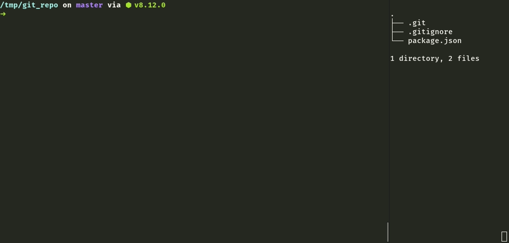

[![Build][build-image]][build-url]
[![License][license-image]][license-url]
[![NPM version][npm-version-image]][npm-version-url]
[![All Contributors][all-contributors-image]](#contributors)
[![code style: prettier][prettier-image]][prettier-url]
[![config: knuckle][knuckle-image]][knuckle-url]

[build-image]: https://img.shields.io/travis/GuillaumeAmat/knuckle.svg?style=flat-square
[build-url]: https://travis-ci.org/GuillaumeAmat/knuckle
[license-image]: https://img.shields.io/github/license/GuillaumeAmat/knuckle.svg?style=flat-square
[license-url]: https://github.com/GuillaumeAmat/knuckle/blob/master/LICENSE
[npm-version-image]: https://img.shields.io/npm/v/knuckle.svg?style=flat-square&colorB=yellow
[npm-version-url]: https://npm.im/knuckle
[all-contributors-image]: https://img.shields.io/badge/all_contributors-3-orange.svg?style=flat-square
[prettier-image]: https://img.shields.io/badge/code_style-prettier-ff69b4.svg?style=flat-square
[prettier-url]: https://prettier.io
[knuckle-image]: https://img.shields.io/badge/config-knuckle-ff5c00.svg?style=flat-square
[knuckle-url]: https://github.com/GuillaumeAmat/knuckle
[eslint-url]: https://eslint.org
[cosmiconfig-url]: https://github.com/davidtheclark/cosmiconfig
[stylelint-url]: https://github.com/stylelint/stylelint
[jest-url]: https://github.com/facebook/jest

# 👊 Knuckle



With Knuckle, _Don't duplicate code_ becomes _Don't duplicate configuration_.

It bootstraps for you configurations and dependencies of your projects dev tools. It also removes the pain of upgrading the configurations and versions over time.

More informations in the [Usage guide](./docs/Usage_guide.md) and the [FAQ](./docs/FAQ.md).

## Available tools

For now, the available tools are:

- [Prettier](config/prettier)
- [ESLint](config/eslint)
- [TSLint](config/tslint)
- [Commitlint](config/commitlint)
- [Lint-Staged](config/lint-staged)
- [Husky](config/husky)

But many others will follow (PRs are welcome by the way ;) ):

- [Stylelint][stylelint-url]
- [Jest][jest-url]
- Etc.

## Badge

[](https://github.com/GuillaumeAmat/knuckle)

```
[](https://github.com/GuillaumeAmat/knuckle)
```

## Contributors

Thanks goes to these people:

<!-- ALL-CONTRIBUTORS-LIST:START - Do not remove or modify this section -->
<!-- prettier-ignore-start -->
<!-- markdownlint-disable -->
<table>
  <tr>
    <td align="center"><a href="https://github.com/frosato-ekino"><br /><sub><b>François Rosato</b></sub></a><br /><a href="https://github.com/knuckle/knuckle/issues?q=author%3Afrosato-ekino" title="Bug reports">🐛</a> <a href="https://github.com/knuckle/knuckle/commits?author=frosato-ekino" title="Code">💻</a> <a href="https://github.com/knuckle/knuckle/commits?author=frosato-ekino" title="Documentation">📖</a> <a href="#example-frosato-ekino" title="Examples">💡</a> <a href="#ideas-frosato-ekino" title="Ideas, Planning, & Feedback">🤔</a> <a href="https://github.com/knuckle/knuckle/pulls?q=is%3Apr+reviewed-by%3Afrosato-ekino" title="Reviewed Pull Requests">👀</a> <a href="https://github.com/knuckle/knuckle/commits?author=frosato-ekino" title="Tests">⚠️</a> <a href="#tool-frosato-ekino" title="Tools">🔧</a> <a href="#tutorial-frosato-ekino" title="Tutorials">✅</a></td>
    <td align="center"><a href="https://github.com/GuillaumeAmat"><br /><sub><b>Guillaume AMAT</b></sub></a><br /><a href="https://github.com/knuckle/knuckle/issues?q=author%3AGuillaumeAmat" title="Bug reports">🐛</a> <a href="https://github.com/knuckle/knuckle/commits?author=GuillaumeAmat" title="Code">💻</a> <a href="https://github.com/knuckle/knuckle/commits?author=GuillaumeAmat" title="Documentation">📖</a> <a href="#example-GuillaumeAmat" title="Examples">💡</a> <a href="#ideas-GuillaumeAmat" title="Ideas, Planning, & Feedback">🤔</a> <a href="#platform-GuillaumeAmat" title="Packaging/porting to new platform">📦</a> <a href="https://github.com/knuckle/knuckle/pulls?q=is%3Apr+reviewed-by%3AGuillaumeAmat" title="Reviewed Pull Requests">👀</a> <a href="#talk-GuillaumeAmat" title="Talks">📢</a> <a href="https://github.com/knuckle/knuckle/commits?author=GuillaumeAmat" title="Tests">⚠️</a> <a href="#tool-GuillaumeAmat" title="Tools">🔧</a> <a href="#tutorial-GuillaumeAmat" title="Tutorials">✅</a></td>
    <td align="center"><a href="https://github.com/mr-wildcard"><br /><sub><b>Julien Viala</b></sub></a><br /><a href="#ideas-mr-wildcard" title="Ideas, Planning, & Feedback">🤔</a></td>
  </tr>
</table>

<!-- markdownlint-enable -->
<!-- prettier-ignore-end -->

<!-- ALL-CONTRIBUTORS-LIST:END -->

This project follows the
[all-contributors](https://github.com/kentcdodds/all-contributors)
specification. Contributions of any kind are welcome!
